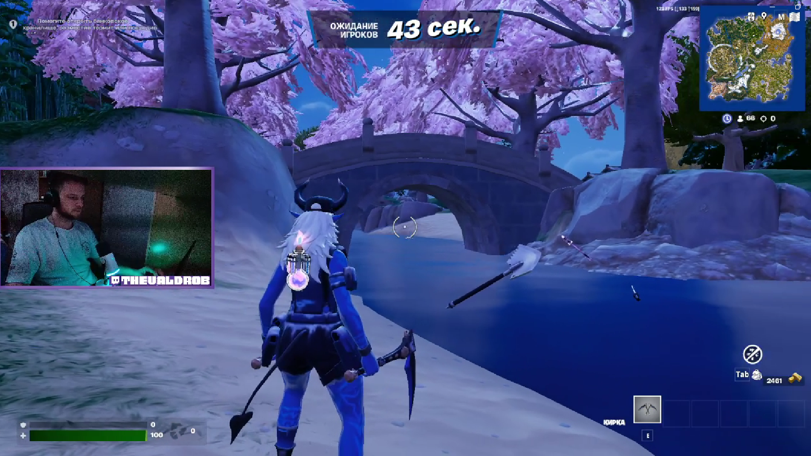

Bug Report Fortnite 2

Game: Fortnite

Platform: PC

Version: 34.10

Type: Graphics

Description:
In Zero Build mode, when spawning in the waiting area, other players are not visible, only their pickaxes are rendered.

Steps to Reproduce:

1.Launch Fortnite.

2.Select Zero Build mode.

3.Click Play.

4.Spawn in the waiting area before the match starts.

Expected Result: All players should be properly displayed in the waiting area.

Actual Result: Only pickaxes of other players are rendered, but their characters are missing.

Reproduction Rate:
1/5 (Occurs once in five attempts).

Severity:
Minor (2) – Causes visual confusion but does not break gameplay.

Attachments: 
