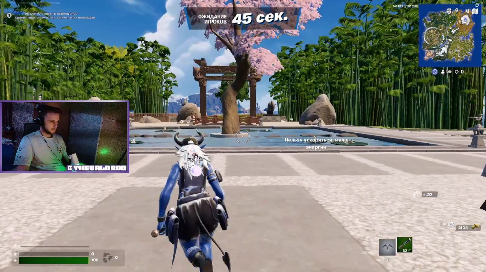

Bug Report Fortnite 3

Game: Fortnite

Platform: PC

Version: 34.10

Type: Graphics

Description:
In the pre-game waiting area, when picking up a weapon, it does not appear in the player's hands immediately but only after 7 seconds.

Steps to Reproduce:

1.Launch the game.

2.Select Zero Build mode.

3.Click Play.

4.Enter the pre-game waiting area.

5.Pick up a weapon.

Expected Result:
The weapon should appear in the player's hands immediately upon pickup.

Actual Result:
The weapon appears in the player's hands after a delay of 7 seconds.

Reproduction Rate:
1/5 (Occurs once in five attempts).

Severity:
Minor (2) – Causes visual confusion but does not break gameplay.

Attachments:Screenshot: 
