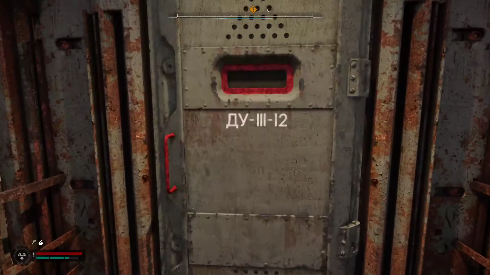

Bug Report 1

Game: S.T.A.L.K.E.R. 2
 Platform: PC
 Version: 1.1.2
 Type: Mechanics

Description:
During the quest Just like in the good old days, the bunker door does not open, preventing interaction with the story NPC, Professor Lodochka.

Steps to Reproduce:

1.Launch the game.

2.Load the latest save.

3.Progress through the Just like in the good old days quest.

4.Reach the bunker in the Wild Island area.

5.Attempt to open the door.

Expected Result: The door should open, allowing entry.

 Actual Result: The door does not display the "Open" interaction prompt.

Reproducibility Rate:
5/5 – The issue occurs every time when following the reproduction steps.

Severity:
Critical –	A serious issue that can break the game, but there are possible workarounds (e.g., severe FPS drops, AI glitches).
 
 Attachments: Screenshots. 

