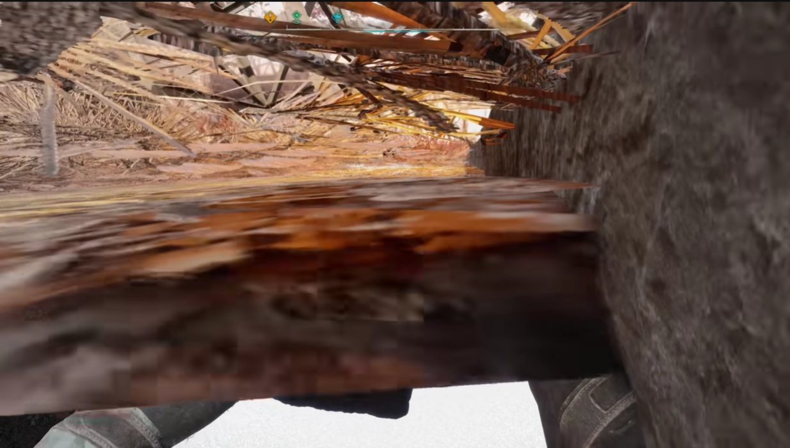

Bug Report 5
Game: S.T.A.L.K.E.R. 2
Platform: PC
Version: 1.1.2
Type: Graphics

Description:
In the Red Forest location, specifically in the Pipe Yard mini-location, the main character holds a bolt in mid-air instead of in his hand.

Steps to Reproduce:

1.Launch the game.

2.Load the latest save.

3.Travel to the Pipe Yard mini-location.

4.Enter the building.

5.Equip a bolt in hand.

Expected Result:
The bolt should be held properly in the character’s hand.

Actual Result:
The bolt appears to be floating in mid-air.

Reproducibility Rate:
1/5 – The bug occurs very rarely, 1 out of 5 attempts.

Severity:
Blocker – A game-breaking bug that makes progress impossible or causes crashes (e.g., quest cannot be completed, save file corruption).

Attachments:
Screenshots. 

