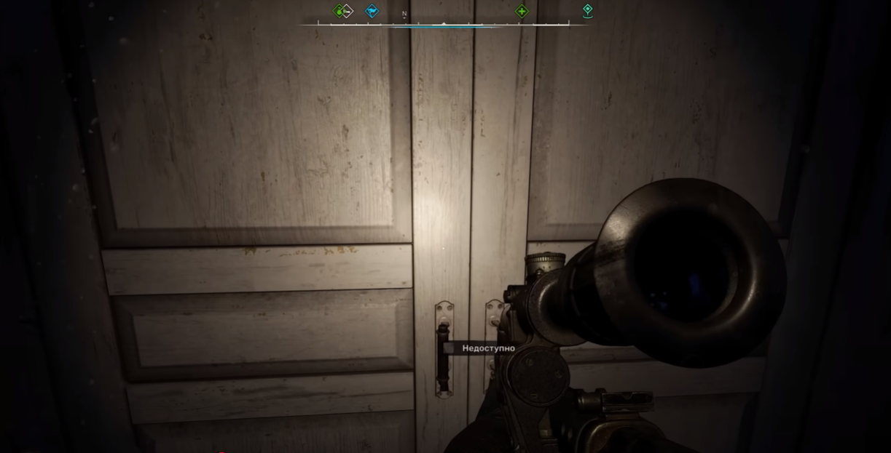

Bug Report 2

Game: S.T.A.L.K.E.R. 2
 Platform: PC
 Version: 1.1.2
 Type: Mechanics

Description: During the Defend Zalissya quest, the door to the building where key NPCs are located does not open.

Steps to Reproduce:

1.Launch the game.

2.Load the latest save.

3.Complete the Order Keepers quest and activate the Signal.

4.After approaching the Small Zone, receive a message from Batya about an attack on Zalissya.

5.Move to the Zalissya location.

6.Try to open the door where Batya was previously sitting.

Expected Result: The door should open, allowing access to the NPCs.

Actual Result: The door is marked as "Unavailable."

Reproducibility Rate: 5/5 – The issue occurs every time when following the reproduction steps.

Severity: Critical –	A serious issue that can break the game, but there are possible workarounds (e.g., severe FPS drops, AI glitches).

Attachments: Screenshots.  

