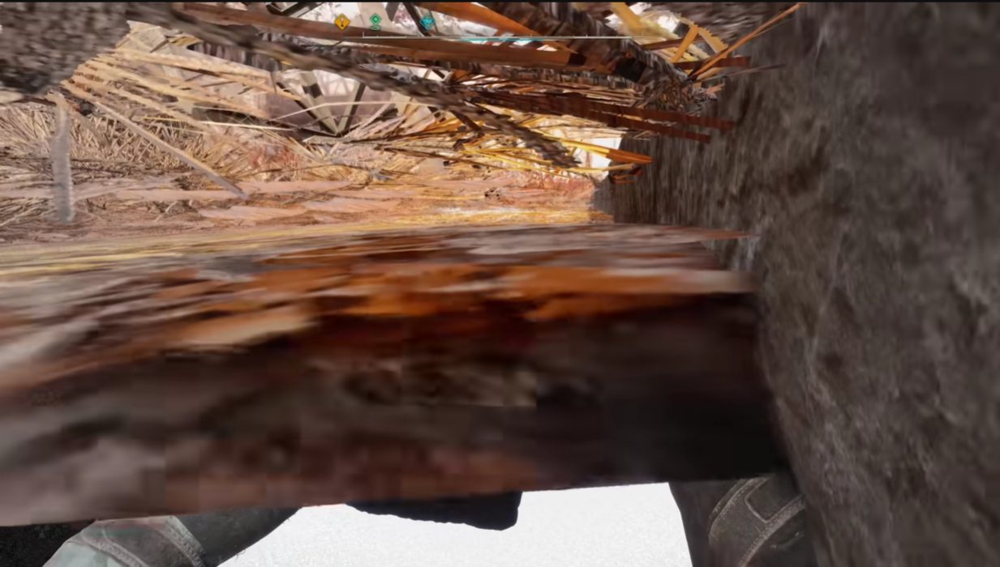

Bug Report 3

Game: S.T.A.L.K.E.R. 2
 Platform: PC
 Version: 1.1.2
 Type: Mechanics

Description: In the Red Forest location, specifically the Pile Driver mini-location, the main character gets stuck under the map.

Steps to Reproduce:

Launch the game.

Load the latest save.

Descend the stairs in the Pile Driver mini-location.

Expected Result: The main character should land on solid ground.
 Actual Result: The character falls through the map and gets stuck without the ability to move.
 Attachments: Screenshots.  

