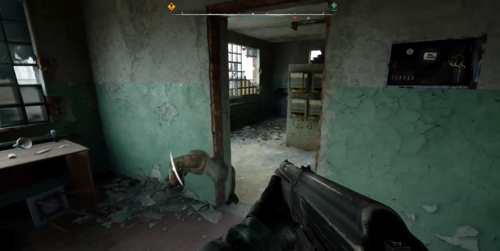

Bug Report 4

Game: S.T.A.L.K.E.R. 2
 Platform: PC
 Version: 1.1.2
 Type: Graphics

Description: In the Yantar location, specifically in the Drenage mini-location, the NPC Snork clips through a wall texture.

Steps to Reproduce:

Launch the game.

Load the latest save.

Travel to the Drenage mini-location.

Enter the building.

Expected Result: The NPC Snork should navigate around the wall.
 Actual Result: The NPC Snork phases through the wall texture.
 Attachments: Screenshots.  

