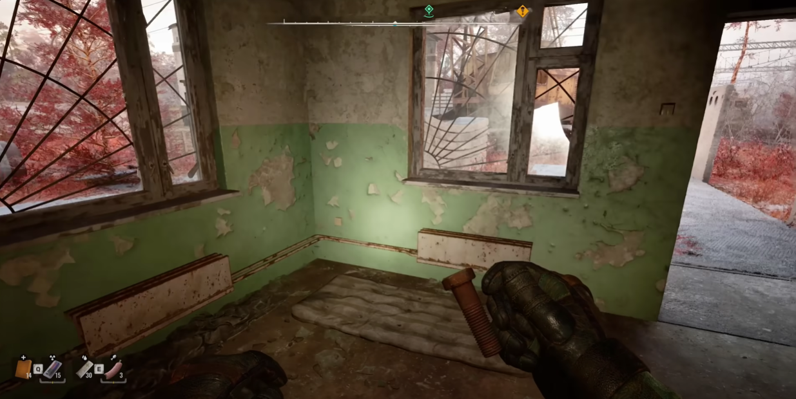

Bug Report 5

Game: S.T.A.L.K.E.R. 2
 Platform: PC
 Version: 1.1.2
 Type: Graphics

Description: In the Red Forest location, specifically in the Pipe Yard mini-location, the main character holds a bolt in mid-air instead of in his hand.

Steps to Reproduce:
Launch the game.
Load the latest save.
Travel to the Pipe Yard mini-location.
Enter the building.
Equip a bolt in hand.

Reproducibility Rate:
1/5 – The bug occurs very rarely, 1 out of 5 attempts.

Severity:
Minor – The issue does not impact gameplay significantly but affects immersion.

Expected Result: The bolt should be held properly in the character’s hand.
 Actual Result: The bolt appears to be floating in mid-air.
 Attachments: Screenshots.  

